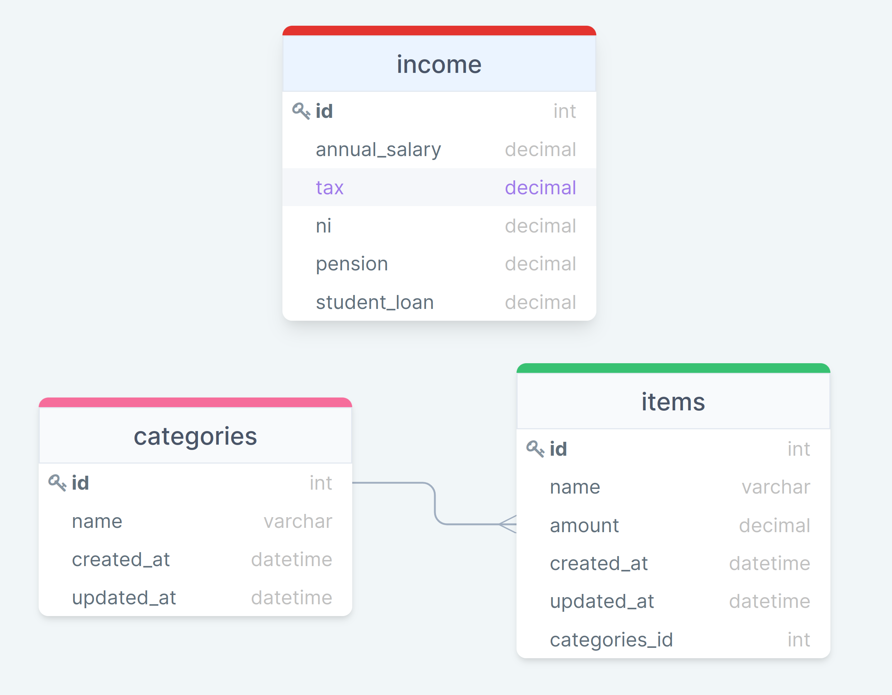

# Budget Planner<!-- omit in toc -->

## Contents<!-- omit in toc -->
- [1. Demo Video](#1-demo-video)
- [2. Introduction](#2-introduction)
- [3. Objectives](#3-objectives)
- [4. Risk Assessment](#4-risk-assessment)
- [5. Web Application](#5-web-application)
  - [5.1. Database](#51-database)
  - [5.2. Planning and development](#52-planning-and-development)
- [6. CI/CD Pipeline](#6-cicd-pipeline)
  - [6.1. Infrastructure](#61-infrastructure)
  - [6.2. Pipeline](#62-pipeline)
  - [6.3. Testing](#63-testing)
- [7. Future Work](#7-future-work)

## 1. Demo Video

## 2. Introduction
This project is the final submission for the QA DevOps bootcamp. I have developed a webapp which can be used to track a user's expenses. The user can record their expense items and expense amount at particular dates under various expense categories. The user is able to view graphical representation of their expenses on the app home page. The app is served through a CI/CD pipeline to the end user. Microsoft azure resources were used to maintain the pipeline. The following sections of this document will go through the development stages of the app and the pipeline.

## 3. Objectives
- To create a web application that integrates with a database and demonstrates CRUD functionality.
- To utilise containers to host and deploy your application.
- To create a continuous integration (CI)/continuous deployment (CD) pipeline that will automatically test, build and deploy your application

## 4. Risk Assessment
Before embarking on the project, it is necessary to identify, assess and plan for the risks associated. The following matrix details the risks that were identified before starting the project.
| Description                                 | Evaluation                                             | Likelihood | Impact | Responsibility       | Control Measures                                                   | Response                                                      |
|---------------------------------------------|--------------------------------------------------------|------------|--------|----------------------|--------------------------------------------------------------------|---------------------------------------------------------------|
| Azure resources  malfunctioning             | App cannot be deployed through  azure                  | Low        | High   | Microsoft            | Backup code to VCS and transfer to another provider                | Move to another  cloud provider                               |
| Exposing logins and secrets on  remote repo | Database and forms can be accessed by unwanted parties | Medium     | High   | Bishal               | Use environmental variables throughout the code                    | Change the login details and secrets of compromised entities  |
| Failed jenkins  pipeline builds             | App fails to deploy                                    | Medium     | High   | Bishal               | Test individual build steps independently in local machine and VMs | Debug the failed build step                                   |
| Failed docker  swarm deployment             | App cannot be deployed                                 | Low        | High   | Bishal               | Test docker stages independently in VM                             | Debug docker stage                                            |
| Cannot connect to  Azure MySQL database     | Database cannot be accessed                            | Low        | High   | Microsoft and Bishal | Connection details stored as environment variables                 | Check for errors in login details, connection url             |
| No connection to nginx load balancer        | App cannot be accessed                                 | Low        | High   | Bishal               | Use public ip of docker swarm nodes in nginx as  a backup          | Check private and public  ip addresses of  docker swarm nodes |
| Source code changes breaking the app        | App cannot be used                                     | Medium     | High   | Bishal               | Use testing to cover most code                                     | Revert to most recent working version                         |

## 5. Web Application
The application is a budget planner where user can keep a running record of their expenses. Each expense item is named and has an amount and date associated with it. The date and amount is useful to produce charts based on the expenses recorded. Each expense item, should also be categorised in an expense category so that the user can view expenses ocurred in each category. The user can also record their income in order to calculate their savings.

The following tools and technologies were used to develop the app:
- VSCode: IDE for coding
- Python: Programming language used
- Flask: Web framework used to develop the app
- MySQL: Database to store the entered data (Azure MySQL database was used)
- Version control: Git and github used as source control measures
  
### 5.1. Database

Current ERD

The database structure consists of 3 tables as shown in the ERD above. The income table is used to record the gross income along with any taxes and contributions. The taxes and contributions are subtracted from the gross income to calculate the take home pay which is also recorded in the table.

The category table records the expense categories and the expense table records the individual expense items. There is a one to many relationship between the category table and expense table.

The diagram below shows the ERD which was prepared at the beginning of the project. A few details have been changed as the project evolved. For example, I got rid of the updated at column from the category and expense tables as I felt there was was no use to record two separate time values.

Old ERD

The database was created on Azure Database for MySQL. The database was configured to accept connections only from azure resources and the local development machine. Using the Azure database ensured that the data persisted on the azure server.

### 5.2. Planning and development

Jira Roadmap

Jira was used to plan and keep track of the app development. User stories were developed to determine the functionalities of the app. Some of the user stories developed were as follows:
- As a user, I want to categorize my expenses, so that I can know where do I spend most
- As a user, I want to add my expense item, so that I can view them later
- As a user, I want to edit my expenses, so that I can rectify mistakes
  
Each user story was assigned a story point estimate and then assigned to an epic. Sprints were conducted lasting 1 week each and where the story points were assigned to the sprints. The backlog of the remaining issues was cleared with each sprint session.

## 6. CI/CD Pipeline
The app was deployed using a CI/CD pipeline. The tools and technologies used for maintaining the pipeline and deployment are:
- Micrsoft azure virtual machines
- Jenkins
- Git and github
- Docker
- Nginx
  
### 6.1. Infrastructure

Infrastructure

The infrastructure used in the CI/CD pipeline consisted of the following Azure resources:
- Azure virtual machine 1: Used to host jenkins server which orchestrates the pipeline builds
- Azure virtual machine 2: Hosts the manager node of the docker swarm deployment
- Azure virtual machine 3: Hosts the worker node of the docker swarm deployment
- Azure virtual machine 4: Hosts nginx server for load balancing and reverse proxy
- Azure Database for MySQL: Database server used in the application
- Azure virtual network and subnet: Connects all the azure resources together  

### 6.2. Pipeline

CI/CD Pipeline

The CI/CD pipeline follows the following steps:
- Development for the app is carried out in a local machine. The code is written in separate feature branches. The code is them merged to the main branch and pushed to Github.
- A webhook trigger is set at Github repo. When a commit is detected, the webhook is triggered.
- The trigger initiates the jenkins pipeline build.
- The latest commit from Github is pulled to the jenkins machine. A virtual environment is setup, dependencies are installed and unit tests are ran.
- When the tests are passed, docker image is built for the app and pushed to docker hub registry.
- Pipeline passes instructions to the docker manager node to pull the app image from registry and deploy 2 replicas in a docker stack
- Pipeline also instructs nginx server to act as load balancer for the docker swarm

The end user can access the app through the nginx public ip and all other resources are hidden from the end user.

### 6.3. Testing

Unit test coverage report

Unit tests are written to test the code. The CI/CD pipeline conducts the unittests, records and publishes the coverage report and shown in the figure above. The tests currently written achieve a coverage of 81% but it is definitely possible to achieve a 100% coverage by adding more tests. 

## 7. Future Work
The following items were identified which can be added to the app and CI/CD pipeline to make it more robust and enhance some functionalities:
- Add more unit tests to achieve maximum coverage.
- Implement integration testing
- Add more charts and chart selections for the app dashboard
- Add individual user account for the app
- Increase the number of nodes in docker swarm
- Implement the CI/CD pipeline using alternative tools like github actions, kubernetes etc.